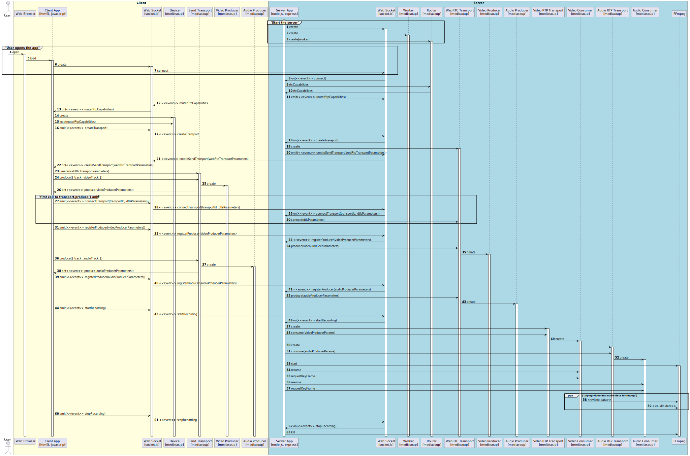

# WebRTC Mediasoup FFmpeg Recorder Proof of Concept

Proof of concept streaming video and audio over WebRTC and capturing a recording server side. Uses socket.io, mediasoup and FFmpeg.

## Quick start

### Backend

```bash
cd backend
pnpm install
pnpm start
```

### Frontend

```bash
cd frontend
pnpm install
pnpm dev
```

### Web browser

Open [http://localhost:1234](http://localhost:1234)

If everything works, then after a few seconds there should be a video created in `backend/files`

If it doesn't work, try reloading the page. There is some sort of race condition where the video is usually, but not always, recorded. Not production grade, but good enough for a basic PoC.

## Call sequence

WebRTC is flexible which leads to it being complex to setup and get working. The call sequence tries to strike a balance to have enough detail without being overwhelming.

